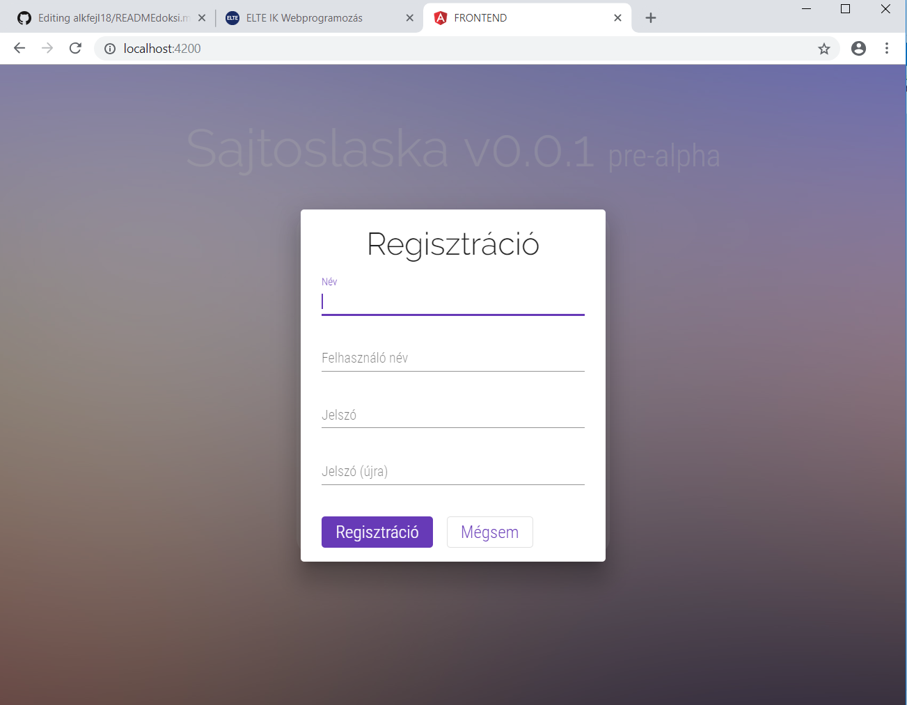
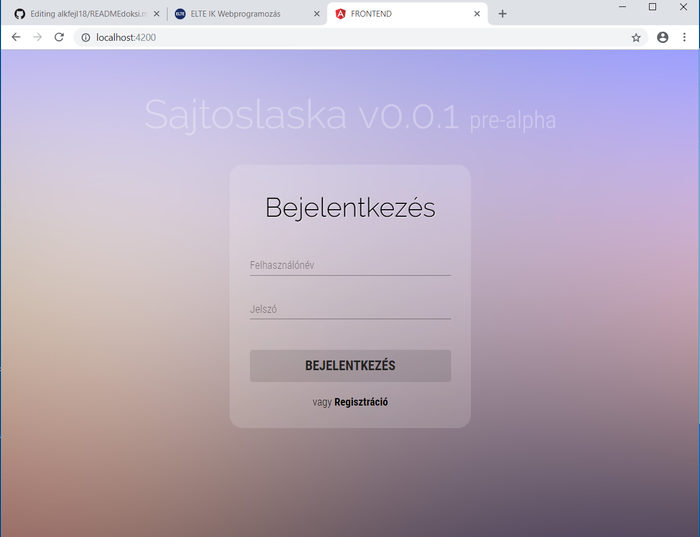
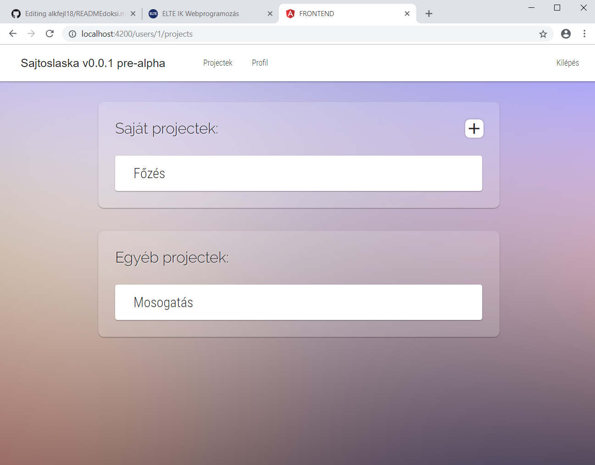
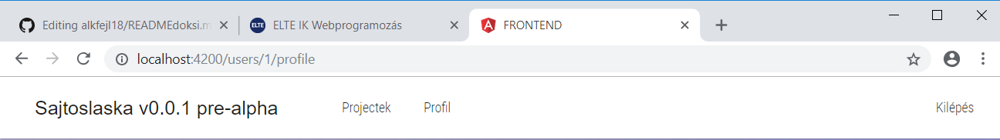
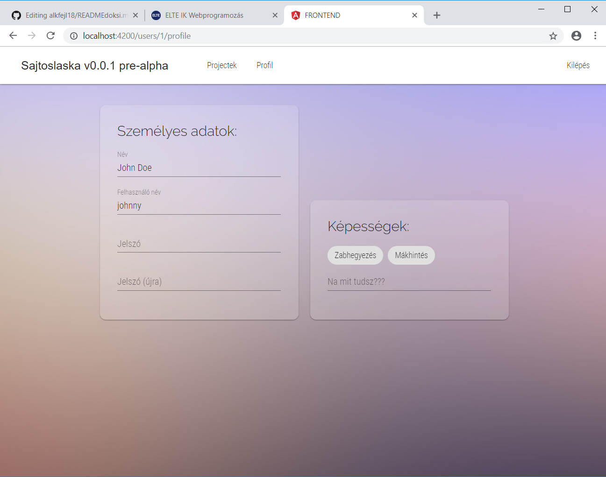
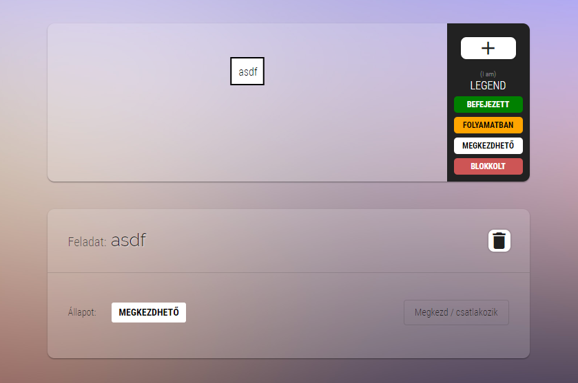

A "The Project Mapper" egy webes alkalmazás, mely segít nyomon követni projektjeink, feladataink haladását. Kiváló alkalmazás munkacsoportok, céges csapatok, baráti társaságok számára, könnyen kézben tarthatjuk vele a részfeladatok haladását, átláthatóvá teszi a szervezési folyamatokat. Egy letisztult, egyszerű projekt menedzselő alkalmazás.

### Fejlesztői megjegyzés

Habár a megoldás már a feladat beadása után született, de az alkalmazást már le lehet tölteni a GitHub Releases fül alatt is. A Travis CI automatikusan feltölti oda a lebuildelt applikációt.

## FELHASZNÁLÓI DOKUMENTÁCIÓ

### 4.1. Regisztráció, bejelentkezés

__Az oldal bárminemű használata csak regisztráció után lehetséges.__

__Regisztrálni__ a főoldalon található "Regisztráció" gomb segítségével lehetséges, ezután egy felugró ablakban űrlap segítségével lehet megadni a felhasználó adatait. Ezután a program automatikusan belépteti a felhasználót a regisztrált adataival.

__Bejelentkezni__ szintén a főoldalon lehetséges, felhasználónév (username) és jelszó (password) megadásával. Ekkor a felhasználót autentikálja az applikáció, majd megjeleníti a "Projektek" oldalt.

__MEGJEGYZÉS:__ Regisztráció nélkül is be lehet lépni az __admin/admin__ felhasználónév és jelszó párossal.

### 4.2. Projektek kezelése

A "Projektek" oldalon a felhasználó megtekintheti az eddigi projektjeit, kiválaszthat egy projektet megtekintésre mások által vezetett projektekből ("__Egyéb projectek__"), szerkesztheti a saját projektjeit vagy a "__Saját projektek__" cím mellett a __+__ ikon segítségével létrehozhat egy új saját projektet. Új projekt létrehozása esetén a felhasználónak meg kell adni a projekt nevét egy felugró ablakban. A további adatait a projektnek (taskok, előfeltételek, felhasználók akik dolgozhatnak a projekten) később tudja hozzáadni, a "Projekt szerkesztése" oldalon.

### 4.3. Menüsáv, felhasználó profilja

A felső __menüsáv__ belépés után mindig látható. 

A "Projectek" menüpont segítségével a felhasználó visszajuthat a főoldalra úgymond, ahol az összes projektje van felsorolva. A "Profil" menüponttal megnyithatja személyes profilját, ahol megváltoztathatja az adatait és felvehet új skilleket.

A menüsávban "Kilépés" menüpontra kattintás után a program értelemszerűen kilépteti a felhasználót és visszadobja a kezdeti Regisztráció/Bejelentkezés oldalra.

### 4.4. Projekt szerkesztése

A felhasználónak lehetősége van __szerkeszteni a projekteket__, a "Projektek" oldalon kell kiválasztania, hogy melyiket. A program ezutántól legenerálja a projekt-részfeladatok-gráfját, ahol ábrázolva van, hogy melyik task milyen másik tasknak az előfeltétele. Amennyiben a felhasználó __kattint egy gráf csúcspontra, avagy taskra__, akkor megtekintheti a task jellemzőit (kik dolgoznak rajta, milyen állapotban van), avagy szerkesztheti a taskot. A "__Megkezd/csatlakozik__" gombbal megkezdheti a taskot, amennyiben az nincs megkezdve, illetve csatlakozhat hozzá, ha már igen. Lehetősége van __törölni a taskot__ a projektből, ha annak nincs ráépülője (semelyik másik tasknak nem előfeltétele) és senki nem kezdte már el. __Új taskot hozzáadni a projekthez__ a leadernek van joga (az a user, aki létrehozta a projektet), ezt a gráf mellett található fehér __+__ gombbal teheti meg.

